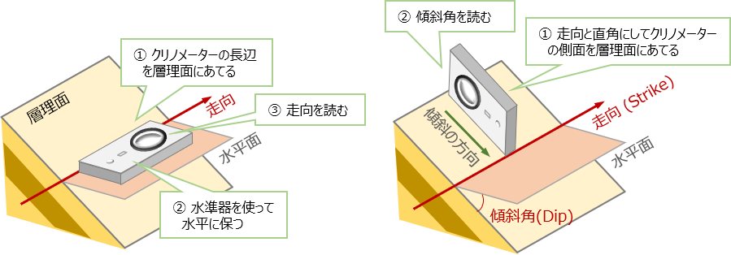
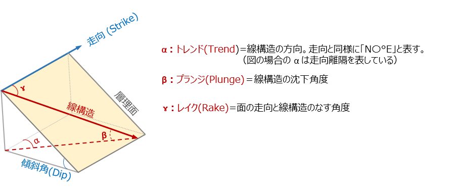

# 2 地質調査法  

## 【演習1】 クリノメーターでの面構造の測定法を理解する  

> クリノメータによる走向・傾斜の測定方法をマスターしましょう。
> 
>   
> 

### 【解答例】  

実際に身の回りにある傾いた平面の走向・傾斜をクリノメーターを使用して測定してみる。

・走向測定時に偏角補正が行えるか？
・傾斜の向きを図るときに間違えないように測れるか？
・地層面を直接測れないときの工夫（走向板の利用や、２方向の層理境界を結んで図る方法など）  

## 【演習2】 クリノメーターでの線構造の測定法を理解する  

> クリノメータによる線構造（トレンド・プランジ・レイク）の測定方法をマスターしましょう。
> 
>   
> 

### 【解答例】  

基本的な測り方は、線構造に合わせて垂直に板をあてて、その板の方向（トレンド）と、水平面からの角度（プランジ）を測ります。