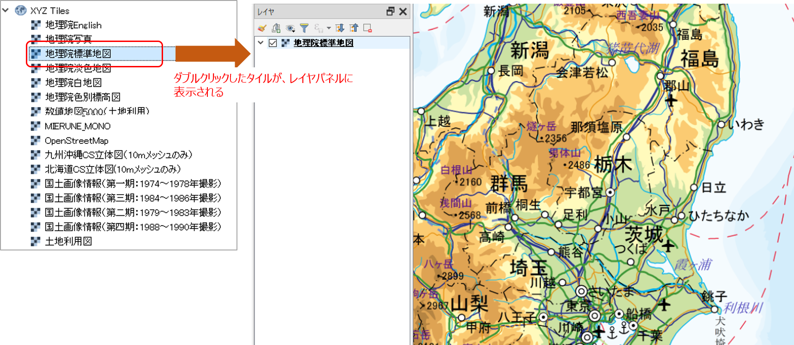

# 5 QGISのインストールと使用方法  

## 【実習1】 QGISをインストールする

> QGISをPCにインストールして使用できるようにしてください。  

====  

### 【解説】  

説明文に従いインストールを行う。  
インターネット通信環境や、各々のPCの環境、PCリテラシー、ソフト操作の習熟度などにより、多人数での演習の場合は思ったより時間がかかるため、この後の基本的な操作の習得の演習と合わせて十分に時間を取って行うことが望ましい。  

## 【実習2】 QGISの基本的な使い方を理解する  

> インストールしたQGISを起動して、自分のいる場所の国土地理院地図を表示させてみましょう。

### 【解説】  

QGISのレイヤで地理院タイルを表示するには、以下の手順で行う。  
タイルを表示するには、**インターネットに接続した環境**でなければなりませんので注意すること。

まず、以下の手順で地理院タイルをQGISでいつでも呼び出せるように定義する。

１． **「ブラウザ」**パネルで **[XYZ Tiles]** を右クリックして **[New Connection]** をクリックする。  

２．**「XYZ接続」**ダイアログで地図タイルのサイトURLを設定して **[OK]** をクリックする（ 下図参照：名称は自由に設定できる）。
  
  

ここで設定する「URL」は、地理院タイルの場合は、  
[https://maps.gsi.go.jp/development/ichiran.html](https://maps.gsi.go.jp/development/ichiran.html) に載っているので、目的の地図のURLを指定して使用すること。

  

次に、上記で定義した地理院タイルをマップキャンバスに表示する。  

1.「ブラウザ」パネルで、上記で追加した地理タイルをダブルクリックする。   
2．「レイヤ」パネルに地理院タイルが追加され、マップキャンバスに地図が表示されていることを確認する。
  
   

3. 地図が表示されたら、マップキャンバスの拡大・終章や移動を行って、自分のいる場所を地図上で探してみる。