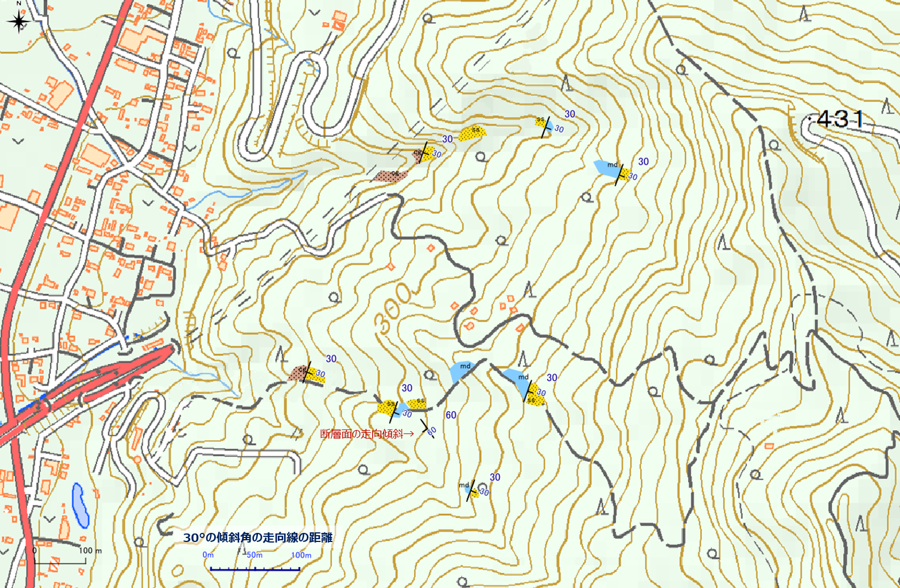
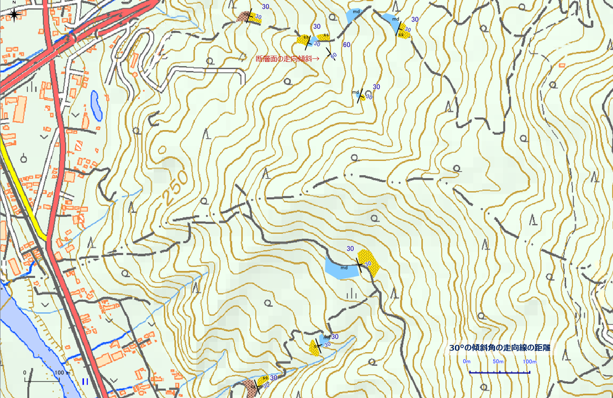
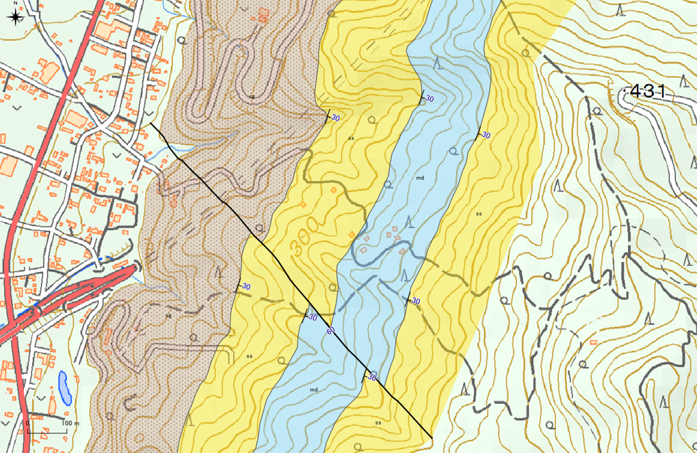
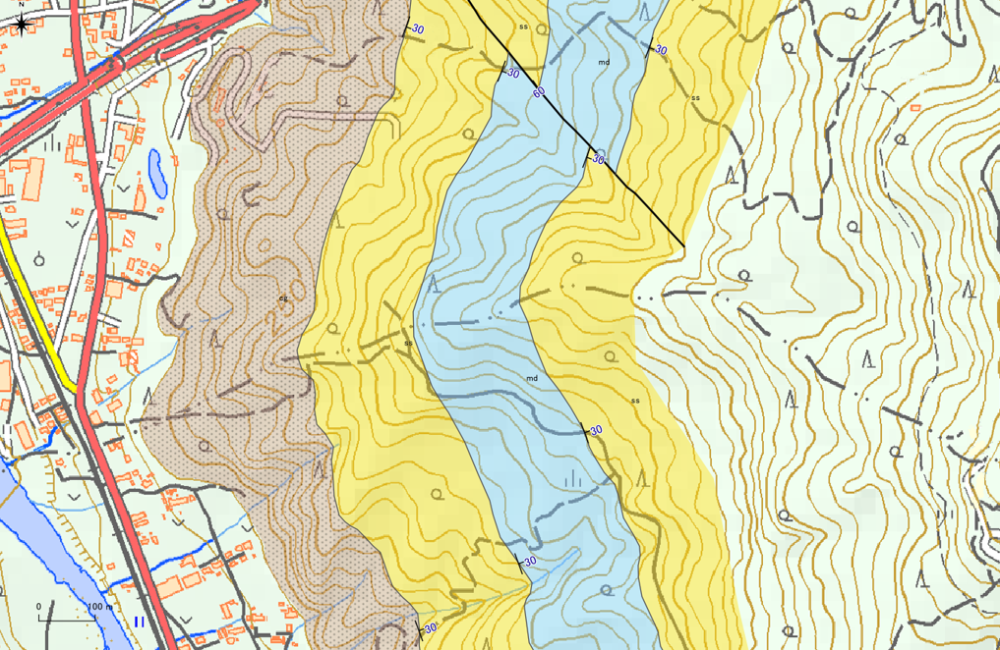
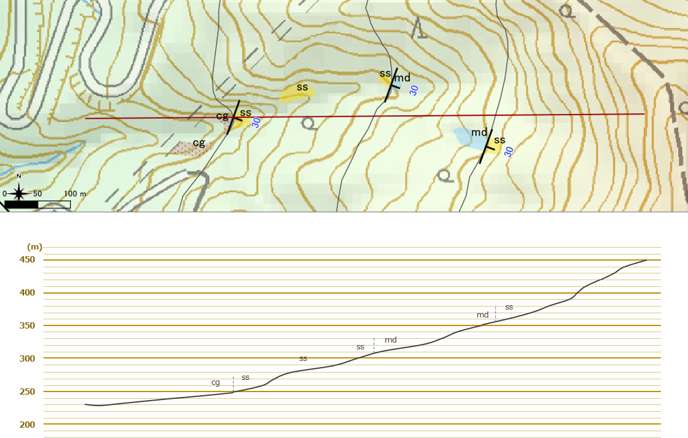
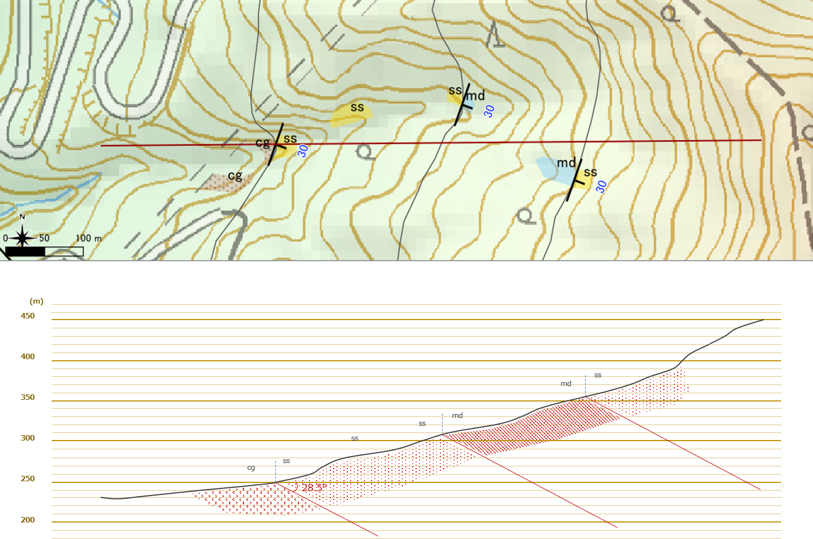

# 7 地質図学演習（境界線の描画）  

## 【演習１】走向線の意味と描画方法を理解する  

>  紙の地形図上に地質境界線を描画してみましょう。  
> * 平らな地層面（単斜構造など）の境界線の描画
> * 褶曲・断層の描画  
> を行ってください。  
>
>   
> <sup>境界線を描画する（１）断層を含む傾斜層</sup>  
>
>   
> <sup>境界線を描画する（２） 褶曲を含む傾斜層</sup>  

====  
### 【解説】    

地図中に記してある「30°の傾斜角の走向線の距離」のスケールを用いて、各地層境界の露頭の走向・傾斜から走向線を引き、境界線を描画していく。

#### <解答例>    

  
<sup>境界線を描画する（１）断層を含む傾斜層</sup>  

  
<sup>境界線を描画する（２） 褶曲を含む傾斜層</sup>  


## 【演習２】QGISを使用した走向線の描画方法を理解する   

> QGISのサンプルプロジェクトファイルを使用して、QGISで地質境界線を描いてみましょう。  
> 
> * 露頭の層理面の走向・傾斜から地質境界線を描画
> * ３点の同一層理面の露頭の標高から地質境界線を描画（３点図法）  
> 

====    

### 【解説】  

QGISの演習問題用プロジェクトファイルをダウンロードして、「地学ライブラリツール」プラグインの編集ツールを用いて境界線を描画する。  
最初はツールの使い方に慣れないため、かなり時間がかかることが予想されるため、十分な時間を取るようにしたい。  
ただし、操作に慣れてくると紙の上で作図するよりも早くできるようになるはずである。

作成例は「演習１」の解答例となる。  


## 【演習３】見掛けの傾斜の求め方を理解する  

> フィールド調査を行い、下図のようなルートマップを作成しました。 ここで、礫岩と砂岩の境界が見られる露頭（境界面の走向・傾斜はN20E）を東西を切る（赤線）の地質断面図を作成しようと思います。
>
>   
> <sup>見掛けの傾斜を求める</sup>  
>
> （１） 断面図上の地層の見掛けの傾斜を計算しましょう。
>
> （２）断面図を描画してみましょう。  
> 

====    

### 【解説】    

（１） 断面図上の地層の見掛けの傾斜を計算する。

```math
tan α = tan δ × sin θ で
θ = 70°、δ = 30°  であるから、
  tan α = 0.577 × 0.940 = 0.542
  α = 28.5°
```

（２）断面図を描画する。  

  