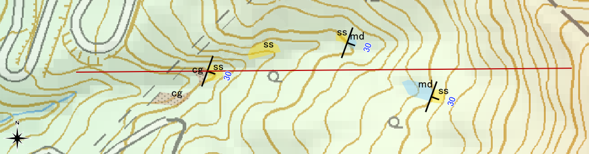
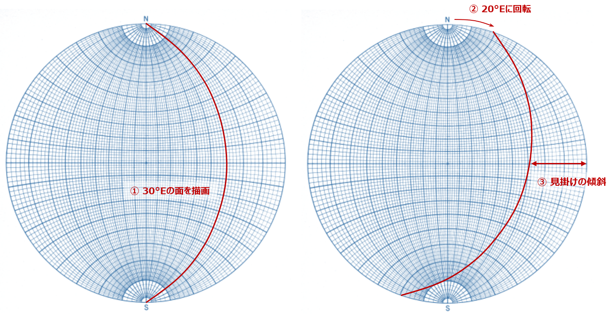
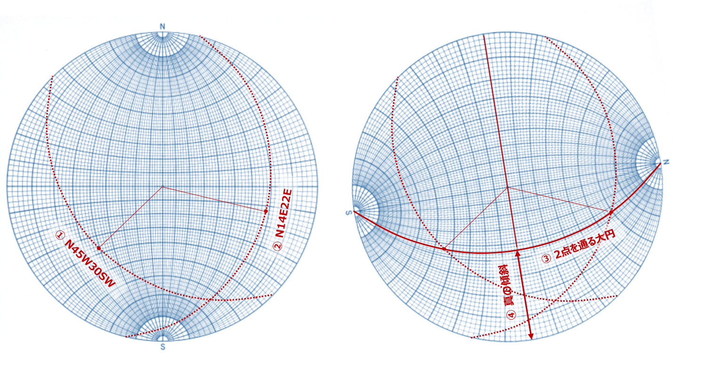

# 8 地質図学演習（ステレオ投影法による解析）  

## 【演習４】ステレオ投影による見掛けの傾斜の求め方を理解する  

> 前章の断面図に表れる見掛けの傾斜をウルフネットを用いて求めなさい。
> 
>   
> 見掛けの傾斜を求める  

====    

### 【解説】 

下図の通りに描画して、前章の計算で求めた場合と同じ値になることを確認する。

 

## 【演習５】ステレオ投影による真の走向傾斜の求め方を理解する   

> ある露頭で直接地層面の走向・傾斜の測定が行えなかったので、２つの見掛け>の走向・傾斜を測定しました。  
> 測定結果は、それぞれ N45W 30SW、N14E 22E でした。  
> ウルフネットを用いて真の走向・傾斜を求めなさい。  

====    

### 【解説】    

図のように、ウルフネットにそれぞれの見掛けの傾斜の点を投影して、それらの点が載っている面（大円）が真の走向・傾斜となる。  

  

