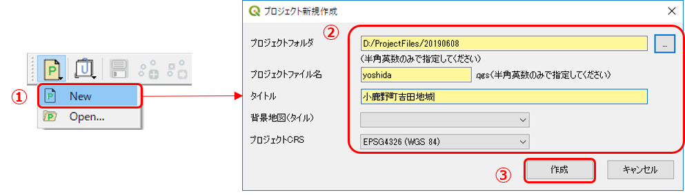
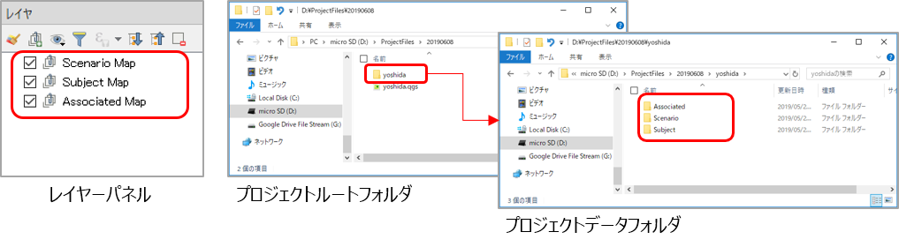
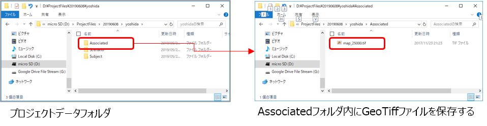
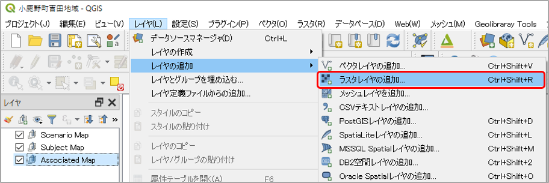
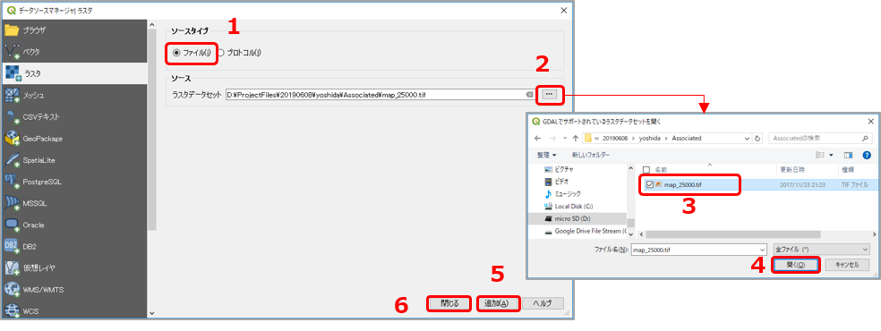
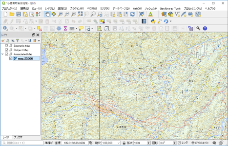

# 9 野外調査のためのQGIS環境の準備  

## 【演習1】 QGISで調査結果をまとめるためのプロジェクト環境を作成する  

> 上記の手順に従い、調査予定地域のプロジェクトファイルを作成しましょう。  

### 【解説】    

通常であれば、「地学ライブラリツール」プラグインの **[Project Tool]>[New]** メニューからプロジェクトの新規作成を行えばよい。

ただし、現地ではインターネットが接続できない（または環境が悪い）ことを想定して、**ジオリファレンスを行った背景地図** を準備したプロジェクトファイルを作成しておく必要がある。

具体的には、以下の手順でプロジェクトファイルを作成して準備する。  

#### 1. QGISを起動し、プロジェクトファイルを作成する。  

  

① 「地学ライブラリツール」プラグインメニューの **[Project Tool]>[New]** をクリックする。  
② 「プロジェクトの新規作成」ダイアログで以下のように入力する。  
　・ プロジェクトフォルダ：プロジェクトファイルを保存する任意のフォルダを指定する（フォルダパスには日本語などの全角文字を使用しないでください）  
　・ プロジェクトファイル名：任意のファイル名（半角英数のみ）を入力する  
　・ タイトル：プロジェクト内容がわかるように任意の名称を入力する  
　・ 背景地図（タイル）：今回は後で背景地図を指定するので、ここは空白のままでOKです。  
　・ プロジェクトCRS：EPSG4326（デフォルトのまま）を指定する  
③ **[作成]** ボタンをクリックすると、プロジェクトが作成され QGIS に読み込まれる。  

  

上の図のように、レイヤーパネルにレイヤーが表示されることを確認する。  
また、②で指定したフォルダにプロジェクト用の各フォルダ・ファイルが作成されていることを確認する。

#### 2. 背景地図をQGISに読み込む。  

オフライン（インターネットに接続されていない）環境でも、背景地図が表示できるように、以下の手順で GeoTiff形式に加工した地形図をQGISに読み込ませます。

① 調査地域である吉田川流域の2万千分の1地形図をGeoTiff形式にしたものを用意しましたので、以下のリンクからダウンロードする。

[吉田川流域地形図（GeoTiff形式）の圧縮ファイル（ZIP)](https://gis.nsb-dank.co.jp/qgis/map_25000.zip)

② ①でダウンロードしたファイルを解凍して、プロジェクトデータフォルダ「
Associated」内に保存する。  

  

③ QGISを表示し、レイヤーパネルの「Associated Map」を選択した状態で、メインメニューの **[レイヤ]-[レイヤの追加]-[ラスタレイヤの追加...]** をクリックする。   

  

④ 「データソースマネージャ」ダイアログの「ラスタ」タブで、下の図のように  
　・ ソースタイプ：「ファイル」を選択
　・ ソース：②で保存したGeoTiffファイルを選択
して、**[追加]** ボタンをクリックすると、マップキャンバスにGeoTiffが表示される。

  

地図が表示されていることを確認したら、 **[閉じる]** ボタンをクリックしてダイアログを閉じる。

  

以上で、調査地域の背景地図を表示したプロジェクトファイルの準備が完了する。

実際の調査結果を記録するには、「地学ライブラリツール」メニューの **[Layer Tool]-[Add Subject Layer]** から地質図（新規作成）を用いて、ルートマップ用レイヤーや地質図用レイヤーを作成して記録していく。 
