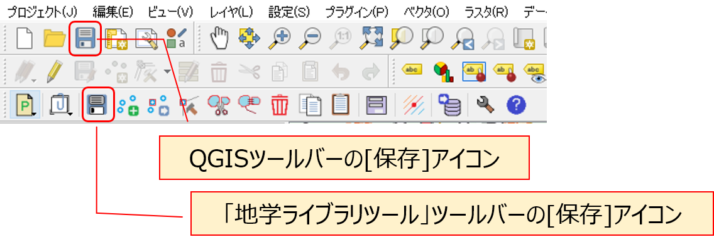

# 10 QGISでルートマップを作成する  

## 【演習1】 QGISでのルートマップの作成法を理解する  

> サンプルプロジェクトファイルを用いて、QGISでルートマップを作成してみましょう。  

### 【解説】  

解説文の手順に従い、QGISを用いたルートマップの作成方法を理解する。  

地物の描画の手順が、通常の図形作図ソフトとは若干異なるため、はじめは操作に戸惑うことが多い。  
また、操作手順を間違えた場合、画面上部に「ワーニング（黄色い帯のメッセージ）」が表示されることがよくある。  
これらが表示された場合は、×をクリックしてメッセージを消して、もう一度操作をやり直せばよいが、どこまでの操作が保存されているか不安である。  

そのため、ひとつの地物の追加や編集を行ったら、以下の操作をまめに行っておくようなクセをつけるとよい。
    * 「地学ライブラリツール」の地物編集ツールバーの[保存]アイコンをクリックする。（編集した地物情報が保存される）  
    * 「QGIS」ツールバーの[保存]アイコンをクリックする。（プロジェクト全体が上書き保存される）  

