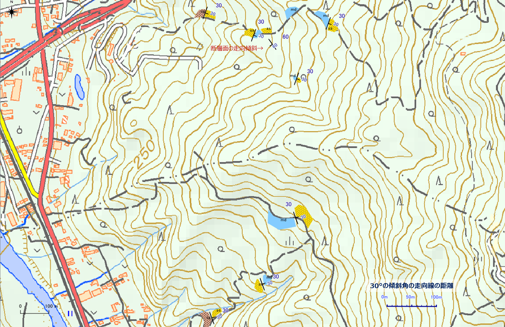

# 【演習】走向線の意味と描画方法を理解する  
 
紙の地形図上に地質境界線を描画してみましょう。  
* 平らな地層面（単斜構造など）の境界線の描画
* 褶曲・断層の描画  
を行ってください。  

  
境界線を描画する（１）断層を含む傾斜層  

  
境界線を描画する（２） 褶曲を含む傾斜層  

***  

【解説】  

地図中に記してある「30°の傾斜角の走向線の距離」のスケールを用いて、各地層境界の露頭の走向・傾斜から走向線を引き、境界線を描画していく。

解答例  

  
境界線を描画する（１）断層を含む傾斜層  

  
境界線を描画する（２） 褶曲を含む傾斜層  
